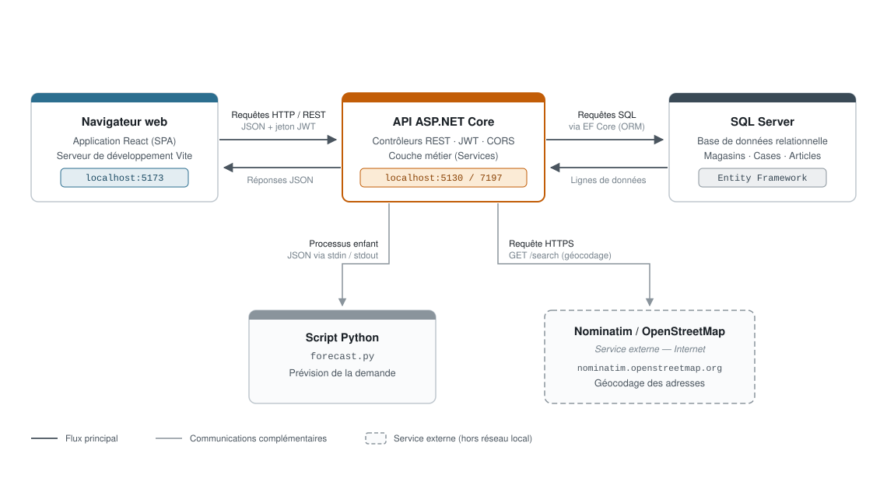

# Architecture réseau — GMD Metal

Communication entre le frontend React, l'API ASP.NET Core et les services
qu'elle mobilise, avec les protocoles et les ports réellement utilisés.

*Figure 4.7 — Architecture réseau et communication entre les composants.*

Le flux principal (traits foncés) relie le navigateur à l'API, puis l'API à la
base de données. Les deux communications complémentaires (traits gris) partent
toutes deux de l'API : l'exécution du script Python pour la prévision, et
l'appel au service de géocodage Nominatim, seul composant situé hors du réseau
local.

## Détail des communications

| Liaison | Protocole | Mise en œuvre |
|---------|-----------|---------------|
| Navigateur → API | HTTP / REST | Requêtes `fetch` depuis `api.js`, en-tête `Authorization: Bearer`, origine `:5173` autorisée par CORS |
| API → SQL Server | TDS (via EF Core) | `UseSqlServer` et `StorageDbContext` |
| API → Script Python | Processus enfant | `ProcessStartInfo("py", "forecast.py")`, JSON sérialisé sur `stdin`, résultat lu sur `stdout` |
| API → Nominatim | HTTPS | `HttpClient` vers `nominatim.openstreetmap.org`, requête `/search` |

## Adresses et ports

| Composant | Adresse |
|-----------|---------|
| Frontend React (serveur de développement Vite) | `http://localhost:5173` |
| API ASP.NET Core | `http://localhost:5130` · `https://localhost:7197` |
| Base de données | SQL Server, accès par Entity Framework Core |
| Service de géocodage | `https://nominatim.openstreetmap.org/` |

## Sources dans le code

- `Storage_backend/Properties/launchSettings.json` — ports de l'API.
- `Storage_backend/Program.cs` — politique CORS (`ReactFrontend`), `AddDbContext`
  / `UseSqlServer`, `HttpClient` Nominatim.
- `Storage_backend/Services/ForecastService.cs` — lancement du processus Python.
- `frontend/src/services/api.js` — appels HTTP et en-tête d'authentification.
