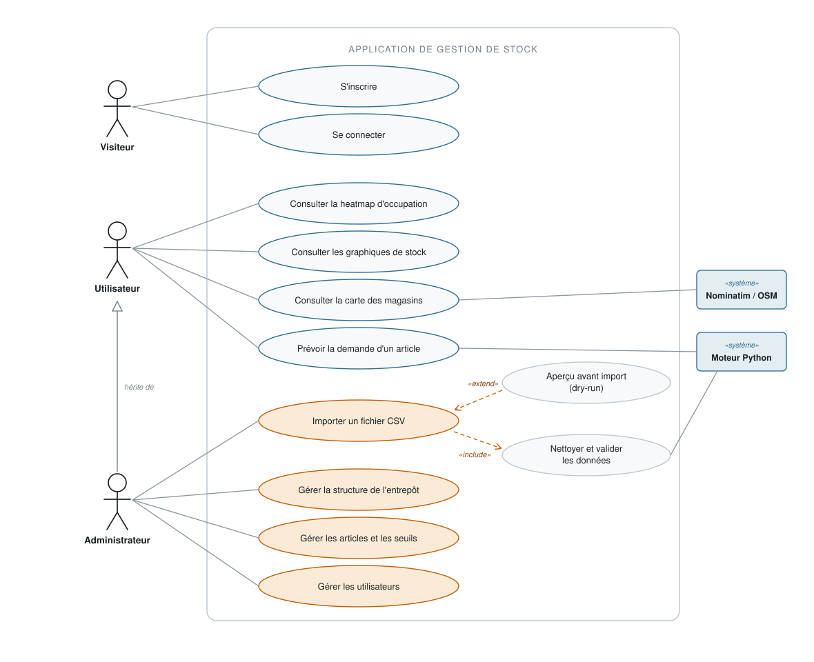

# Diagramme de cas d'utilisation — GMD Metal

Acteurs de l'application de gestion de stock et fonctionnalités auxquelles chacun
accède, tels qu'ils sont réellement implémentés dans le contrôle d'accès de l'API.

Le fichier [`diagramme-cas-utilisation.svg`](./diagramme-cas-utilisation.svg) est
autonome (couleurs littérales, aucune dépendance) : il s'insère directement dans
Word ou LibreOffice pour le rapport de stage.

## Droits par acteur

La séparation des rôles est appliquée côté API par les attributs d'autorisation,
et reflétée côté interface par le filtrage des onglets.

| Acteur | Cas d'utilisation | Contrôle d'accès |
|--------|-------------------|------------------|
| **Utilisateur** | S'inscrire · Se connecter · Consulter la heatmap · les graphiques · la carte des magasins · Prévoir la demande d'un article | `[Authorize]` |
| **Administrateur** | Tout ce qui précède, plus : importer un fichier CSV · gérer la structure (magasins, rayons, zones, cases) · gérer les articles et les seuils · gérer les utilisateurs | `[Authorize(Roles = "admin")]` |

## Relations UML employées

| Relation | Entre | Signification |
|----------|-------|---------------|
| Généralisation | Administrateur → Utilisateur | L'administrateur possède tous les droits de l'utilisateur, et davantage. |
| `«include»` | Importer un fichier CSV → Nettoyer et valider les données | Le nettoyage est **toujours** exécuté lors d'un import : étape obligatoire. |
| `«extend»` | Aperçu avant import → Importer un fichier CSV | Le dry-run est **facultatif** : il enrichit l'import sans être requis. |

## Sources dans le code

- Attributs `[Authorize]` / `[Authorize(Roles = "admin")]` des contrôleurs
  (`ArticleController`, `CaseController`, `DonneeController`, `MagasinController`,
  `RayonController`, `UsersController`, `ZoneController`, `ForecastController`).
- Filtrage `ADMIN_TABS` / `USER_TABS` dans `frontend/src/App.jsx`.
- Inscription et connexion dans `AuthController`.
