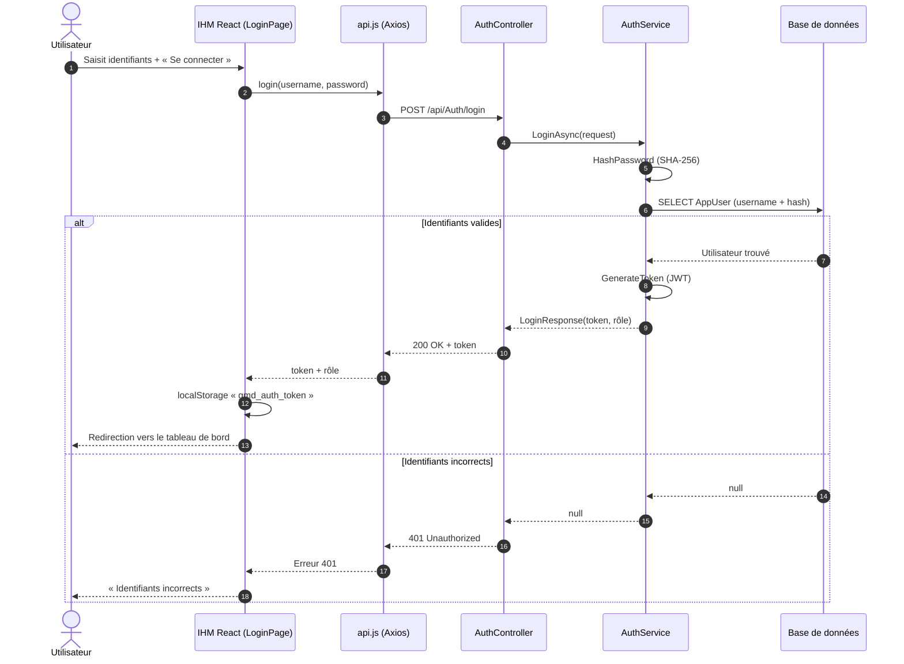
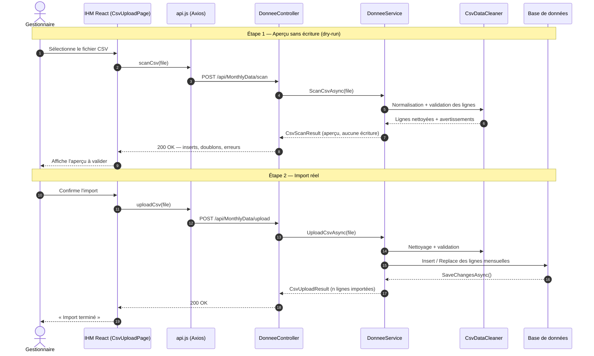
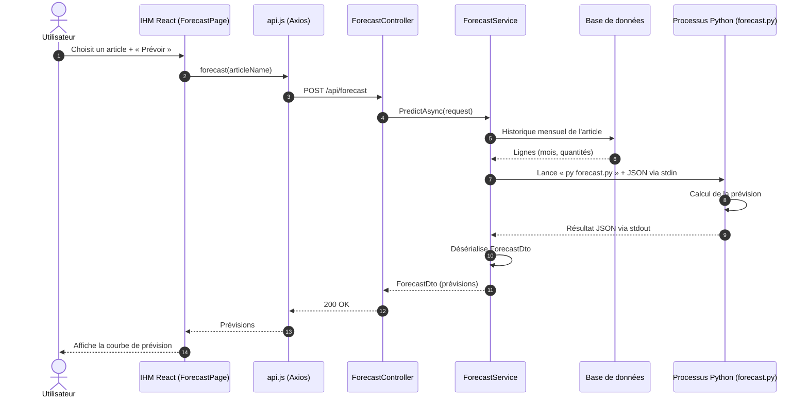
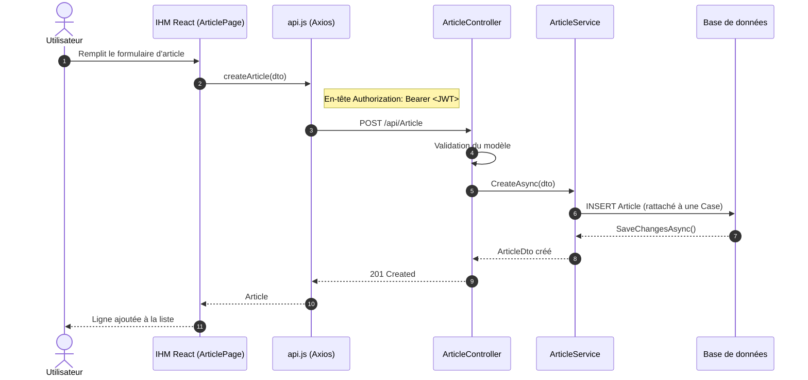
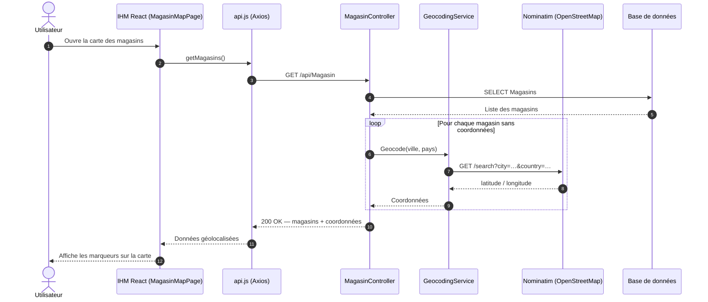

# Diagrammes de séquence — GMD Metal

Modélisation UML des cas d'utilisation clés de l'application de gestion de
stock. Les diagrammes ci-dessous se rendent automatiquement sur GitHub (blocs
Mermaid) et peuvent être exportés en image pour le rapport de stage.

## Combien de diagrammes ?

On ne modélise pas chaque CRUD, mais les **cas d'utilisation les plus
représentatifs** — ceux dont les interactions portent une vraie valeur
technique. **5 diagrammes** sont retenus :

| # | Cas d'utilisation | Priorité | Intérêt technique |
|---|-------------------|----------|-------------------|
| 1 | Authentification | Essentiel | Hachage SHA-256 + génération de jeton JWT |
| 2 | Import CSV (scan + upload) | Essentiel | Nettoyage Python, dry-run, persistance |
| 3 | Prévision de la demande | Essentiel | Interop C# → sous-processus Python |
| 4 | Création d'un article (CRUD) | Complémentaire | Cas type de tous les CRUD hiérarchiques |
| 5 | Carte des magasins | Complémentaire | Appel à un service externe (Nominatim) |

> **Version allégée :** les 3 premiers suffisent pour un rapport concis.
> Les 5 offrent une couverture complète, CRUD et service externe compris.

### Architecture
`React (IHM) → api.js (Axios) → ASP.NET Core (Contrôleur → Service) → EF Core → Base de données`,
avec des sous-processus **Python** (prévision) et un appel **externe** (géocodage).

---

## 1 — Authentification

`POST /api/Auth/login`

---

## 2 — Import CSV (aperçu + import)

`POST /api/MonthlyData/scan` · `POST /api/MonthlyData/upload`

---

## 3 — Prévision de la demande

`POST /api/forecast`

---

## 4 — Création d'un article (CRUD type)

`POST /api/Article`

---

## 5 — Carte des magasins (géocodage)

`GET /api/Magasin`

