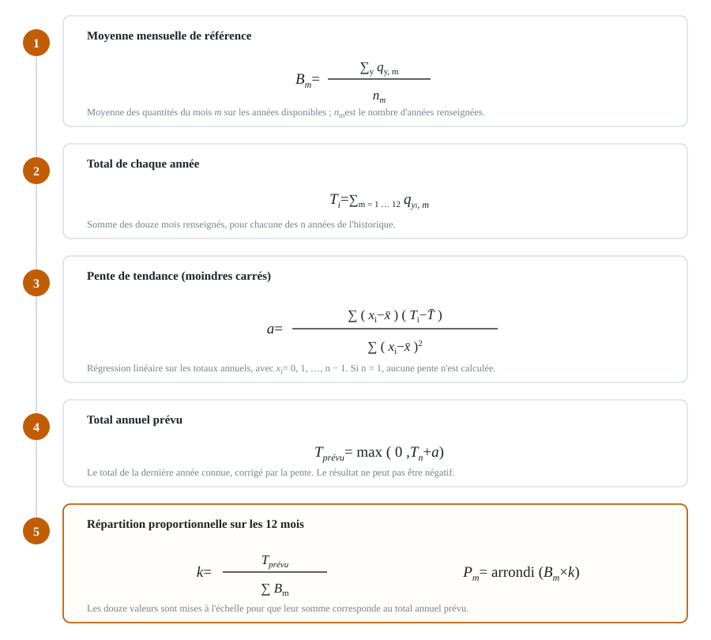

# Calcul de la prévision — GMD Metal

Les cinq étapes du calcul, énoncées en mots plutôt qu'en notation mathématique.
Implémentation : `Storage_backend/Python/forecast.py`, fonction
`forecast_series()`.

*Figure — Les cinq étapes du calcul de la prévision.*

## Les cinq étapes

1. **Moyenne de chaque mois**
   `Moyenne du mois = total de ce mois sur toutes les années ÷ nombre d'années disponibles`
2. **Total de chaque année**
   `Total d'une année = somme de ses 12 mois`
3. **Pente de tendance**
   `Pente = progression moyenne du total, par an`
   Obtenue par régression linéaire sur les totaux annuels — voir
   [l'exemple détaillé](./regression-lineaire.md).
4. **Total prévu pour l'année suivante**
   `Total prévu = dernier total connu + pente`
5. **Prévision de chaque mois**
   `Prévision du mois = moyenne du mois × (total prévu ÷ somme des moyennes)`

On obtient 12 valeurs, dont la somme est égale au total prévu.

## Exemple chiffré

| Étape | Calcul | Résultat |
|-------|--------|----------|
| Totaux annuels | Relevés pour 2023 puis 2024 | 1 200 puis 1 400 |
| Pente | Progression d'une année à l'autre | + 200 par an |
| Total prévu | 1 400 + 200 | 1 600 |
| Somme des moyennes | (1 200 + 1 400) ÷ 2 | 1 300 |
| Un mois | Si la moyenne de janvier vaut 100 : 100 × (1 600 ÷ 1 300) | 123 |

## À noter

Le calcul est exécuté **deux fois**, indépendamment : une fois sur les quantités
entrées (`quantiteEntrer`) et une fois sur les quantités sorties
(`quantiteSortie`). La réponse renvoyée au frontend contient donc **deux
séries** de douze valeurs.

Deux garde-fous sont appliqués : la prévision ne peut jamais être négative, et
si une seule année d'historique est disponible, aucune pente n'est calculée.
