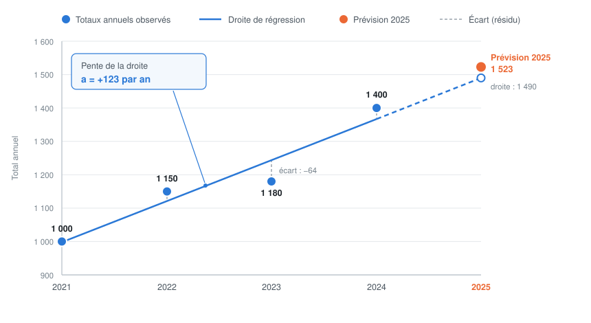

# La régression linéaire — exemple chiffré

Explication de l'étape 3 du calcul de prévision (`forecast_series()` dans
`Storage_backend/Python/forecast.py`), sur un exemple de quatre années.

## L'idée

On connaît le total consommé chaque année. Ces totaux montent globalement, mais
pas de façon régulière. Pour résumer cette montée par un seul nombre, on trace
**une droite** à travers le nuage de points : sa pente indique de combien on
progresse en moyenne chaque année.

Aucune droite ne passe exactement par tous les points. On choisit donc celle
dont les **écarts verticaux aux points** sont les plus petits possible — d'où le
nom « **moindres carrés** » : on minimise la somme des carrés de ces écarts.



*Figure — Nuage des totaux annuels, droite de régression et projection.*

## Les données

| Année | Indice x | Total annuel T |
|-------|----------|----------------|
| 2021 | 0 | 1 000 |
| 2022 | 1 | 1 150 |
| 2023 | 2 | 1 180 |
| 2024 | 3 | 1 400 |

Les années sont numérotées 0, 1, 2, 3 : cela simplifie les calculs sans rien
changer au résultat.

## Le calcul de la pente

Moyennes : `x̄ = 1,5` et `T̄ = 1 182,5`.

| Année | x | T | x − x̄ | T − T̄ | (x−x̄)(T−T̄) | (x−x̄)² |
|-------|---|---|--------|--------|--------------|---------|
| 2021 | 0 | 1 000 | −1,5 | −182,5 | 273,75 | 2,25 |
| 2022 | 1 | 1 150 | −0,5 | −32,5 | 16,25 | 0,25 |
| 2023 | 2 | 1 180 | +0,5 | −2,5 | −1,25 | 0,25 |
| 2024 | 3 | 1 400 | +1,5 | +217,5 | 326,25 | 2,25 |
| **Somme** | | | | | **615** | **5** |

```
a        = 615 / 5                 = 123
T_prévu  = max( 0 , 1 400 + 123 )  = 1 523
```

L'article progresse donc d'environ **123 unités par an**.

## Détail d'implémentation

Le code ne lit pas la valeur de la droite en 2025 (qui vaudrait 1 490). Il prend
le **dernier total réel** et lui ajoute la pente : `1 400 + 123 = 1 523`. Ce
choix ancre la prévision sur l'année la plus récente plutôt que sur la moyenne
des quatre années, ce qui la rend plus réactive si la dernière année marque une
rupture.

Les chiffres de cet exemple sont illustratifs.
